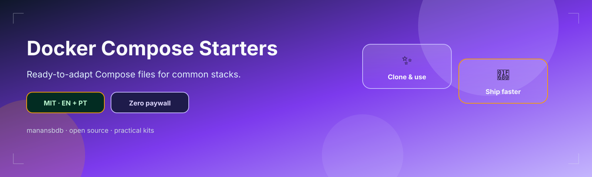
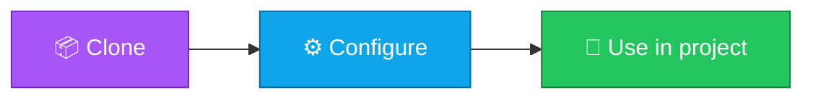

<p align="center">
  
</p>

<h1 align="center">docker-compose-starters</h1>

<p align="center">
  <strong>EN</strong> Ready-to-adapt Compose files for common stacks.<br/>
  <strong>PT</strong> Ficheiros Compose prontos a adaptar para stacks comuns.
</p>

<p align="center">
  <a href="https://github.com/manansbdb/docker-compose-starters/blob/main/LICENSE"></a>
  
  
  <a href="#support--apoio"></a>
</p>

---

## What it does / Para que serve

| English | Português |
|---------|-----------|
| Ready-to-adapt Compose files for common stacks. | Ficheiros Compose prontos a adaptar para stacks comuns. |



---

## Install / Instalação

### 1) Clone

```bash
git clone https://github.com/manansbdb/docker-compose-starters.git
cd docker-compose-starters
```

### Use / Usar

```bash
cd postgres-redis && docker compose up -d
```

### Requirements / Requisitos

- `git`
- No paid services required / Sem serviços pagos

---

## What's included / O que inclui

| Path | EN | PT |
|------|----|----|
| `postgres-redis/docker-compose.yml` | PostgreSQL + Redis | PostgreSQL + Redis |
| `nginx-app/docker-compose.yml` | Nginx reverse proxy + app | Nginx reverse proxy + app |

## Quick start / Início rápido

```bash
cd postgres-redis && docker compose up -d
```

**EN:** Copy env examples, set passwords, and never commit real secrets.

**PT:** Copia os exemplos de env, define passwords e nunca faças commit de segredos reais.

---

## Support / Apoio

Bitcoin donations welcome / Doações em Bitcoin bem-vindas:

```
bc1q0qfnlnxyum9u45stzxe0a7jnhtj4j0usfkqdjw
```

**Network / Rede:** BTC (Bech32).

---

## License / Licença

[MIT](./LICENSE) © 2026 manansbdb
