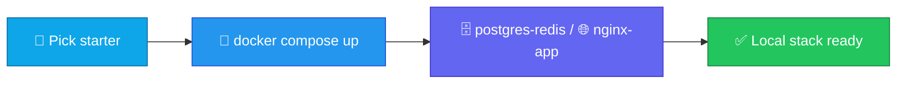

<p align="center">
  
</p>

<h1 align="center">docker-compose-starters</h1>

<p align="center">
  <strong>EN</strong> Compose starters: Postgres+Redis and nginx+app<br/>
  <strong>PT</strong> Starters Compose: Postgres+Redis e nginx+app
</p>

<p align="center">
  <a href="https://github.com/manansbdb/docker-compose-starters/blob/main/LICENSE"></a>
  
  
  <a href="#support--apoio"></a>
</p>

---

## What it does / Para que serve

| English | Português |
|---------|-----------|
| **Docker Compose** starters for local stacks — Postgres+Redis and nginx reverse-proxy + app. | Starters **Docker Compose** para stacks locais — Postgres+Redis e nginx + app. |
| Copy a folder, `docker compose up`, and wire your app. | Copia uma pasta, `docker compose up`, e liga a tua app. |



---

## Install / Instalação

### 1) Clone / Clona

```bash
git clone https://github.com/manansbdb/docker-compose-starters.git
cd docker-compose-starters
```

### 2) Run a starter / Corre um starter

```bash
# Postgres + Redis
cd postgres-redis && docker compose up -d

# or nginx + app
cd ../nginx-app && docker compose up -d
```

### 3) Copy into your project / Copia para o projeto

```bash
cp -R postgres-redis /path/to/your-project/deploy/
# or: cp -R nginx-app /path/to/your-project/deploy/
```

### Requirements / Requisitos

- `git`
- Docker Engine + Docker Compose v2

---

## Quick start / Início rápido

```bash
git clone https://github.com/manansbdb/docker-compose-starters.git
cd docker-compose-starters/postgres-redis
docker compose up -d
```

---

## Contents / Conteúdos

| Path | Purpose / Função |
|------|------------------|
| `postgres-redis/docker-compose.yml` | Postgres + Redis stack |
| `nginx-app/docker-compose.yml` | nginx + app compose |
| `nginx-app/nginx.conf` | Sample reverse-proxy config |
| `SUPPORT.md` | Donations / Doações |

---

## Project layout / Estrutura

```text
docker-compose-starters/
├── docs/banner.svg
├── postgres-redis/docker-compose.yml
├── nginx-app/docker-compose.yml
├── nginx-app/nginx.conf
├── SUPPORT.md
└── README.md
```

---

## Support / Apoio

Bitcoin donations welcome / Doações em Bitcoin bem-vindas:

```
bc1q0qfnlnxyum9u45stzxe0a7jnhtj4j0usfkqdjw
```

See [SUPPORT.md](./SUPPORT.md).

---

## License / Licença

[MIT](./LICENSE) © 2026 manansbdb
